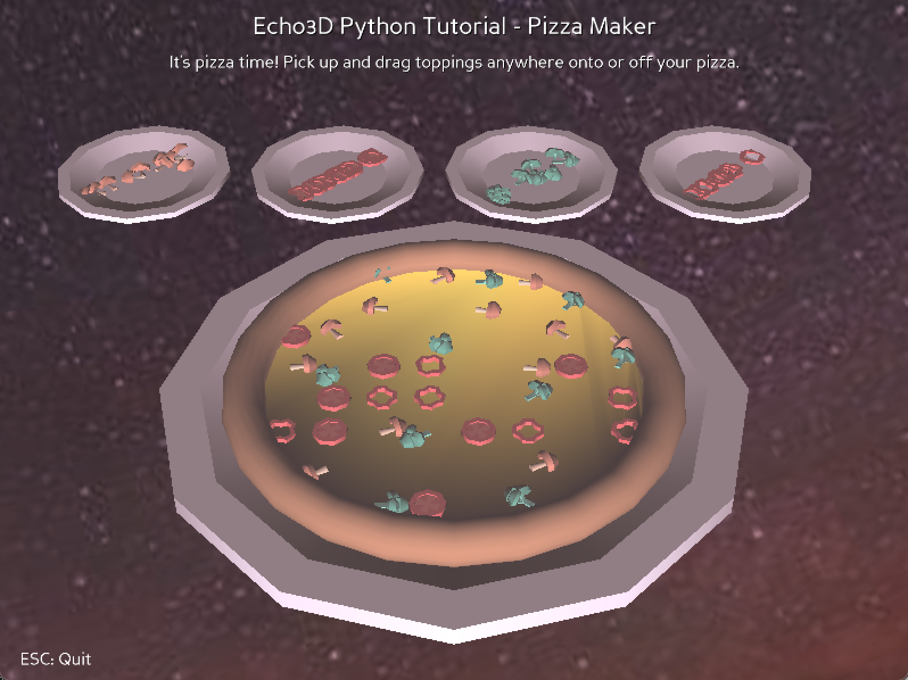

# Unity-PizzaMaker-echo3D-demo-python
 
This Python demo uses echo3D's 3D model streaming in combination with [Panda3D](https://www.panda3d.org/), a framework for 3D rendering and game development in Python. Currently, any .obj or .glb model can be uploaded to the echo3D console and streamed into this app. The app allows you to design your own pizza given the available pepperoni, mushroom, broccoli, or pepper toppings. You can click on any pizza topping, whether on the pizza or on the extra topping plates, to pick up and move the topping to your desired location. However, feel free to use [echo3D's expansive functionality](https://docs.echo3d.com/) to modify the toppings to your pizza-preferences!



## Register
* Don't have an API key? Make sure to register for FREE at [echo3D](https://console.echo3D.co/#/auth/register).

## Setup
* Download and install Python 3.8.16 from https://www.python.org/downloads/release/python-3816/.
* Clone this project onto your local machine. 
* Set up [Panda3D](https://www.panda3d.com/) according the instructions matching your operating system. 
* Upload the contents of the [models folder](./models/) through the [echo3D console](https://console.echo3D.co).
* Update the values of each key-value pair in the [model_constants.py file](./echo3D-pizza-maker/model_constants.py) to match the entity id's of each model you uploaded to the echo3D console in the step before. 

You can also add your own models to the [echo3D console](https://console.echo3D.co) by searching or adding your own, as each person may have their own pizza topping preferences. Just make sure to update the values in the [model_constants.py file](./echo3D-pizza-maker/model_constants.py) to match the entity ids' of the models you uploaded. 

## Run
Navigate to the [echo3D-pizza-maker folder](./echo3D-pizza-maker/) in your terminal, and run the following command:
```
python main.py [YOUR_ECHO3D_API_KEY] [YOUR_ECHO3D_SECURITY_KEY]
```

## Learn more
Refer to our [documentation](https://docs.echo3d.com/python/using-the-sdk) to learn more about how to use Python and echo3D.

If you want more demos of Panda3D's technology, there are additional demos created by Panda3D in their [github samples folder](https://github.com/panda3d/panda3d/tree/master/samples). Although these do not incorporate echo3D, they show off a lot more functionality. Please see [Panda3D's website](https://docs.panda3d.org/1.10/python/index) to see documentation. 

## Support
Feel free to reach out at [support@echo3D.co](mailto:support@echo3D.co) or join our [support channel on Slack](https://go.echo3D.co/join).

## Screenshots


Demo created by [LeaBroudo](https://github.com/LeaBroudo/).